# Firefox Developer Tools

_Jason Weathersby · [@jasonweathersby](https://twitter.com/jasonweathersby)_

[github.com/JasonWeathersby/connectjs15](ttps://github.com/JasonWeathersby/connectjs15)

***


<!-- .element: style="max-width:50%" -->

***

## Agenda

1. Overview of the Firefox Devtools
2. Network Performance
3. Framerate Performance
4. Memory Performance

---

## Developer Tools

_Getting around the Firefox Developer Tools_

***

### Inspector

 [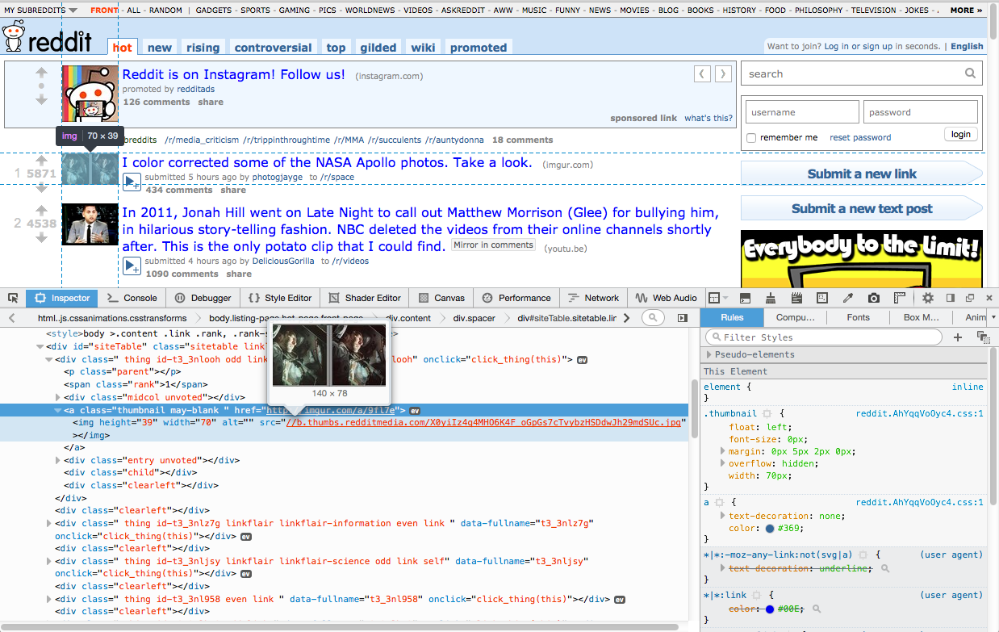](https://developer.mozilla.org/en-US/docs/Tools/Page_Inspector)

***

### Console

[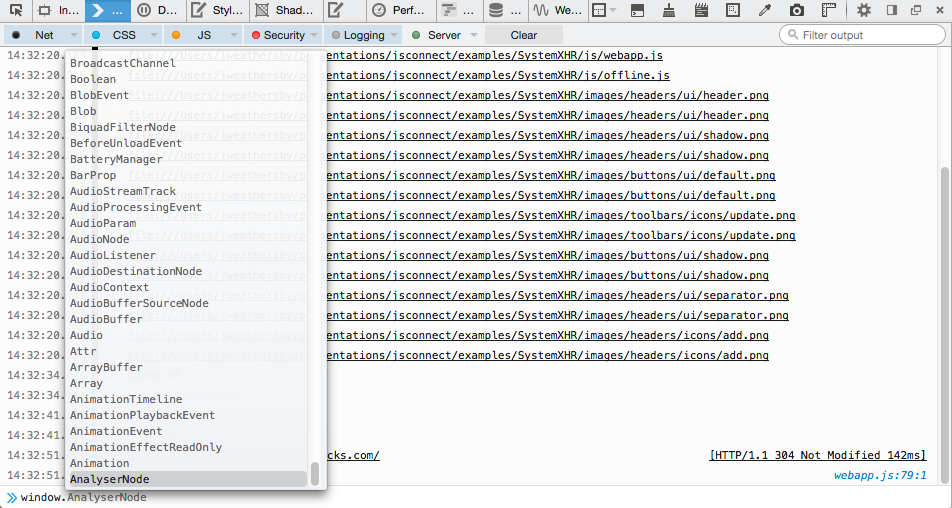](https://developer.mozilla.org/en-US/docs/Tools/Web_Console)
***

### Style Editor

[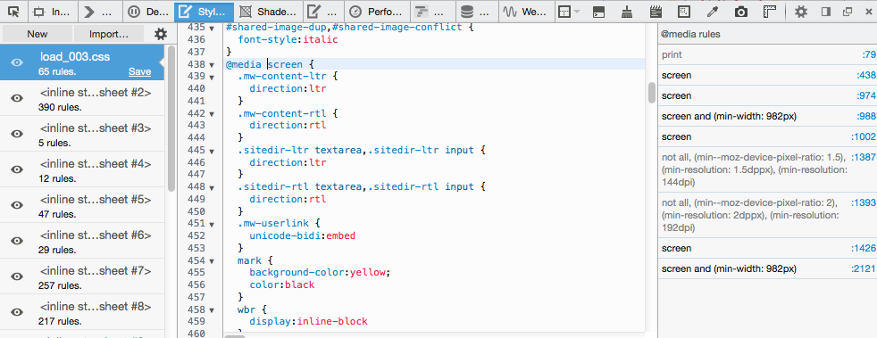](https://developer.mozilla.org/en-US/docs/Tools/Style_Editor)

***

### JavaScript Debugger

[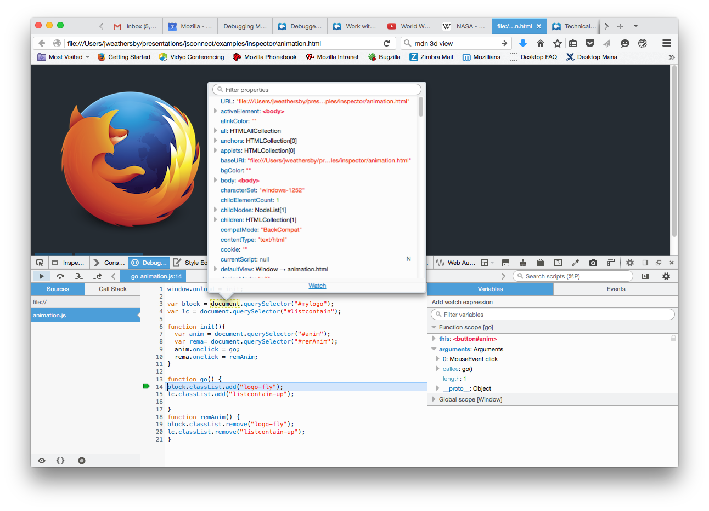](https://developer.mozilla.org/en-US/docs/Tools/Debugger)

***

### Network Monitor

[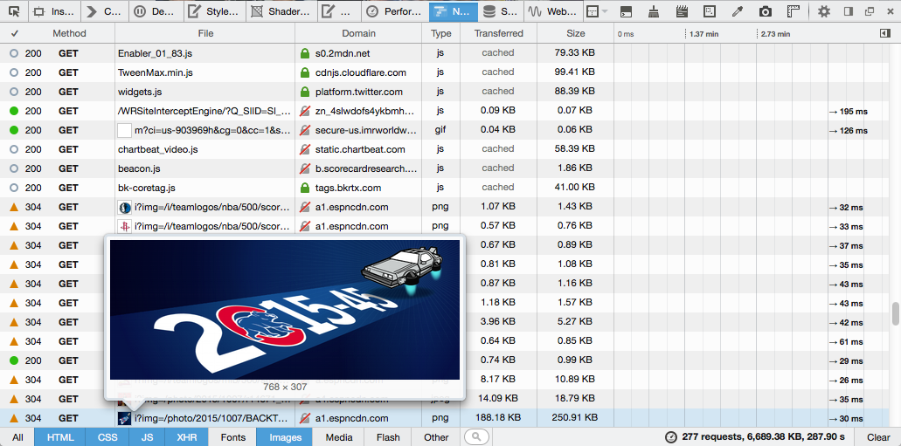](https://developer.mozilla.org/en-US/docs/Tools/Network_Monitor)

***

### Storage Inspector

[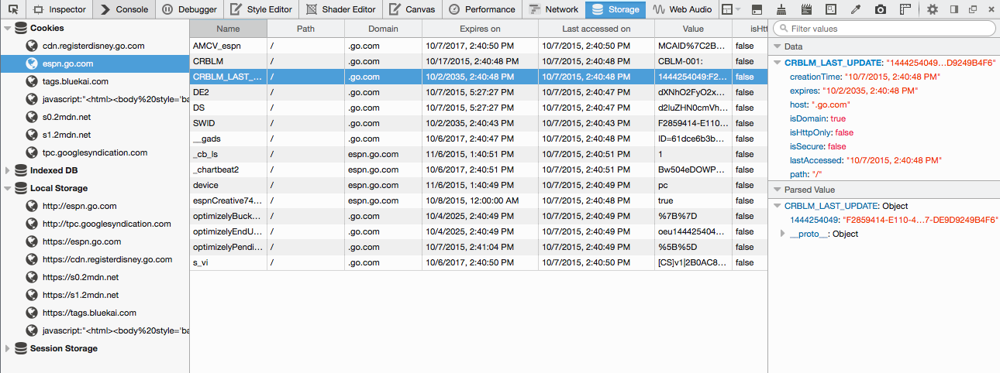](https://developer.mozilla.org/en-US/docs/Tools/Storage_Inspector)
***

### Shader Editor

[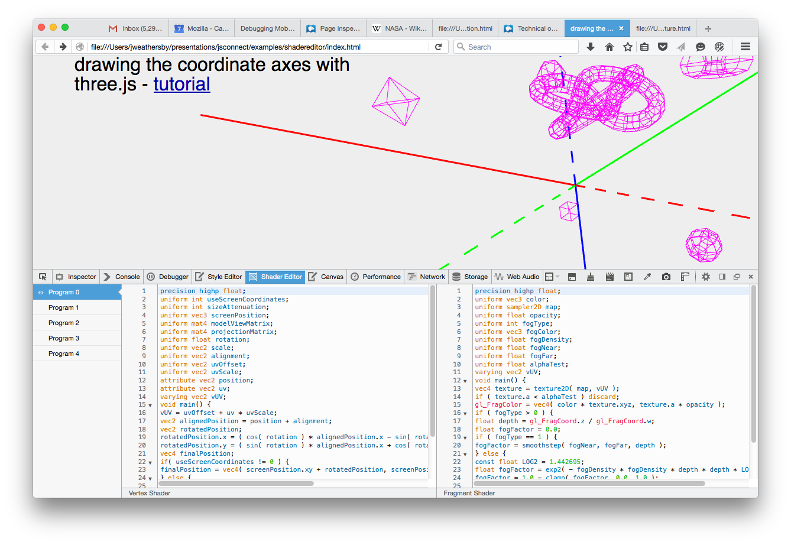](https://developer.mozilla.org/en-US/docs/Tools/Shader_Editor)
***

### Canvas Debugger

[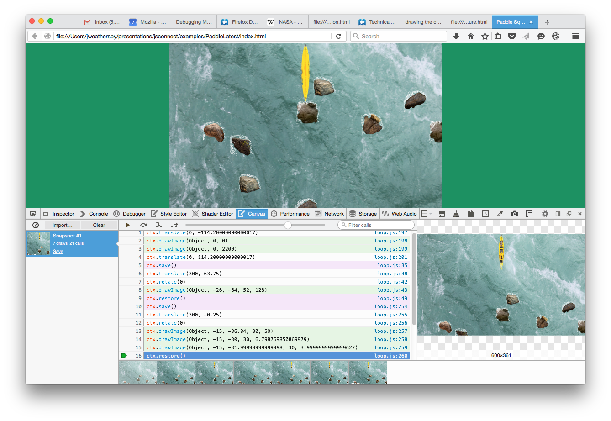](https://hacks.mozilla.org/2014/03/introducing-the-canvas-debugger-in-firefox-developer-tools/)
***

### Web Audio Editor

[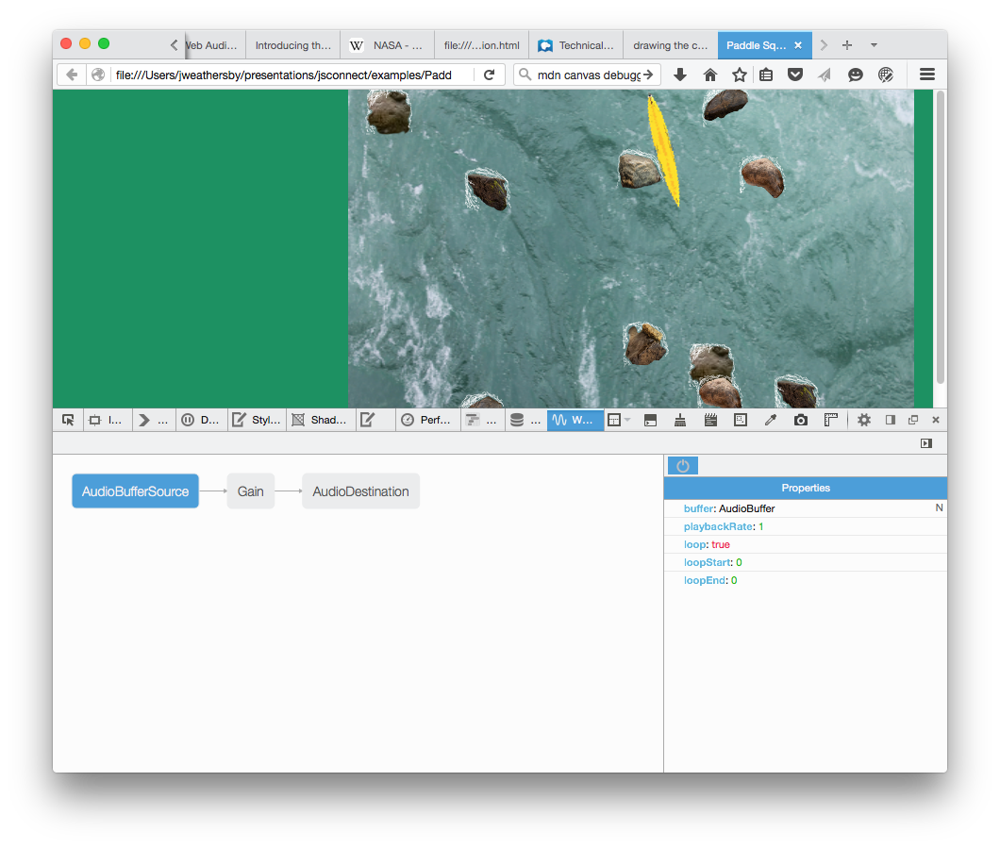](https://developer.mozilla.org/en-US/docs/Tools/Web_Audio_Editor)
***

### Web IDE

[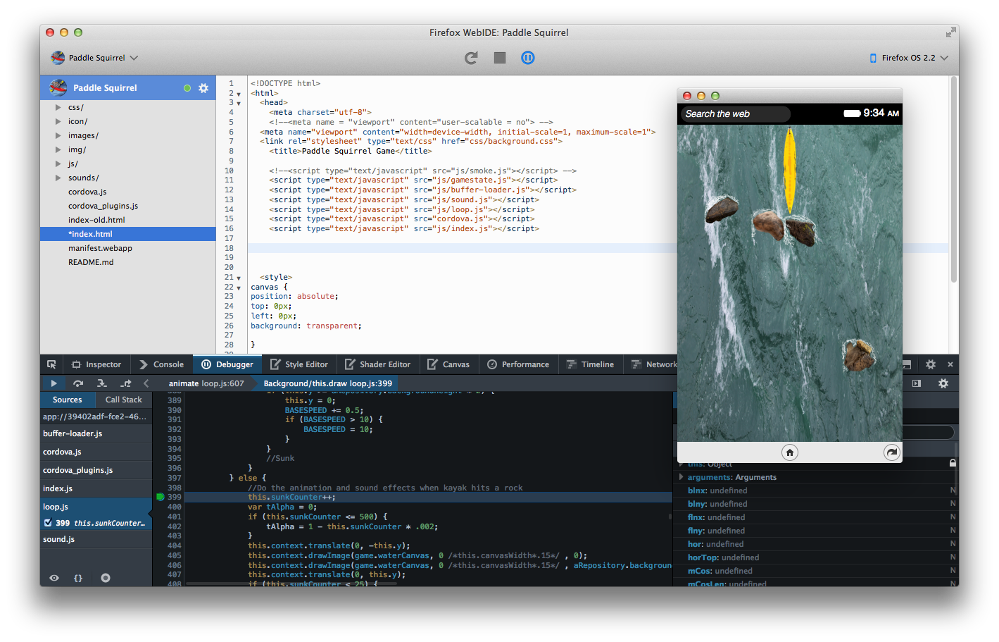](https://developer.mozilla.org/en-US/docs/Tools/WebIDE)


---

## Performance

_Recognizing Performance Issues With the Developer Tools_


***
### Sometimes Measuring Performance Feels Like


***
### Areas of Measurement

1. Network Performance
2. Frames Per Second
3. Memory Usage

---
## Network Performance

_Can you hear me now?_

***

### What do we care about?

1. Time until something appears.
2. Time until the page is interactive.

_Hack the first to get better __perceived speed__._

Note: Script tag at end of body, cache headers, etc.

***


<!-- .element: style="max-width:90%" -->

***

### Network Perf Tools

1. Get to know your Network Panel
2. [webpagetest.org](http://webpagetest.org)
3. [developers.google.com/speed/pagespeed/insights/](https://developers.google.com/speed/pagespeed/insights/)

***

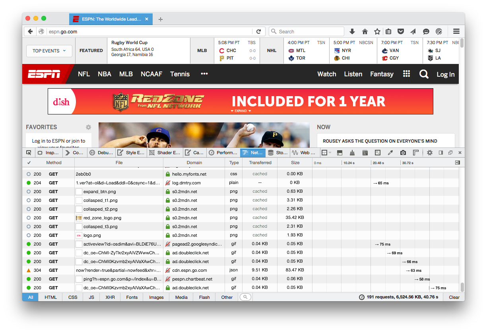
***

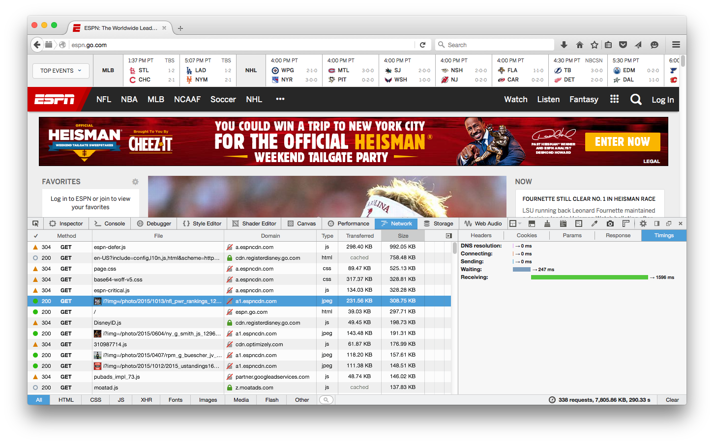
***

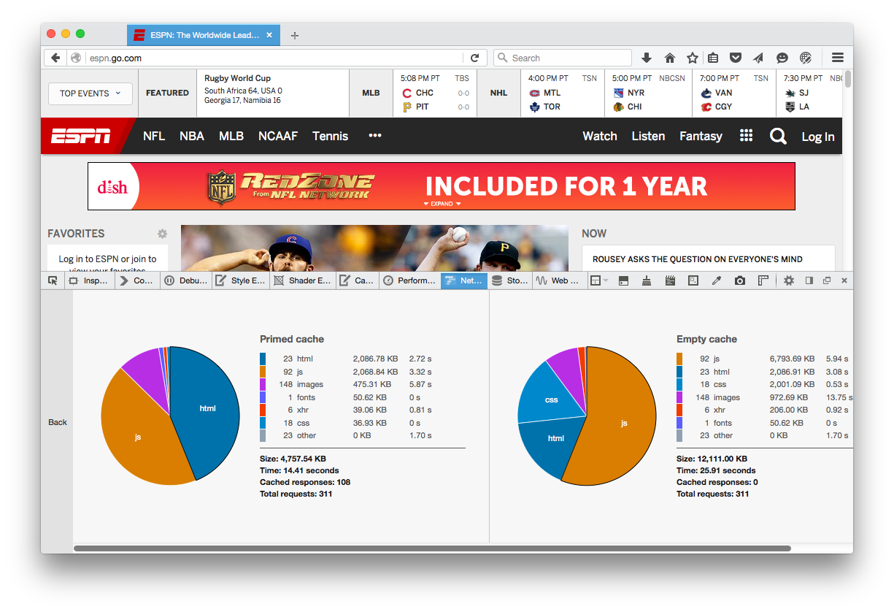
***

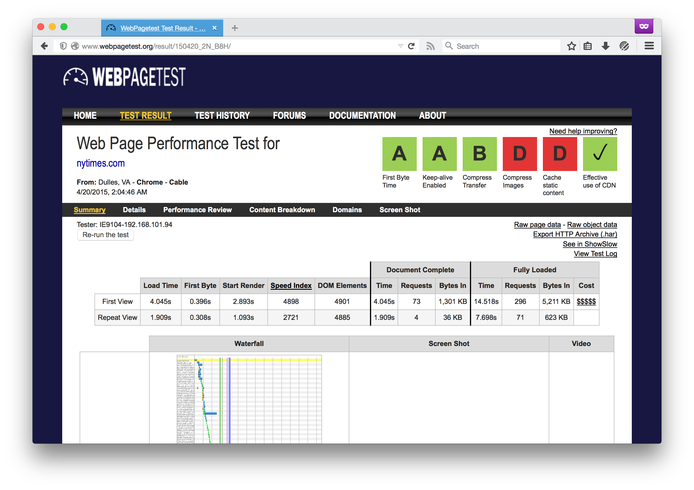

***
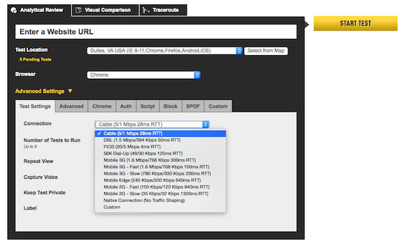
* DOMContentLoaded vs OnLoad Event
* Offers improvement checklist, and displays timeline charts
* Lets you test location, browser and connection type

***

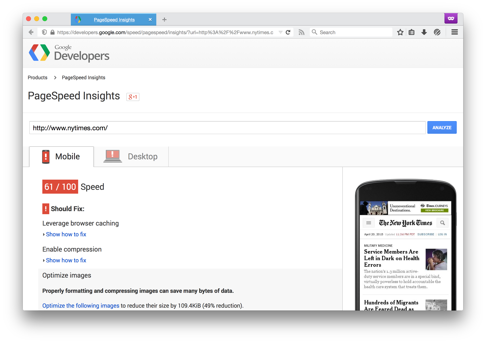

***

### Simulating Bad Connections

* [Clumsy - Windows](https://jagt.github.io/clumsy/)
* [Network Link Conditioner - Mac](http://nshipster.com/network-link-conditioner/)
* [Chrome DevTools](https://developer.chrome.com/devtools/docs/device-mode#network-conditions)


***

### Standard Practices

1. Minify + Gzip
2. Compress / Remove Images/GIFs
3. Serve appropriate images

Note: All about reducing page weight

***
```html
<picture>
  <source srcset="../examples/images/extralarge.jpg" media="(min-width: 1000px)">
  <source srcset="../examples/images/art-large.jpg" media="(min-width: 600px)">
  
</picture>
```
* Use media queries for image selection 
* [Picturefill demo](https://scottjehl.github.io/picturefill/examples/demo-02.html)
---

## Framerate Performance
_60 FPS means 16 ms per frame_
***

### Render Pipeline 

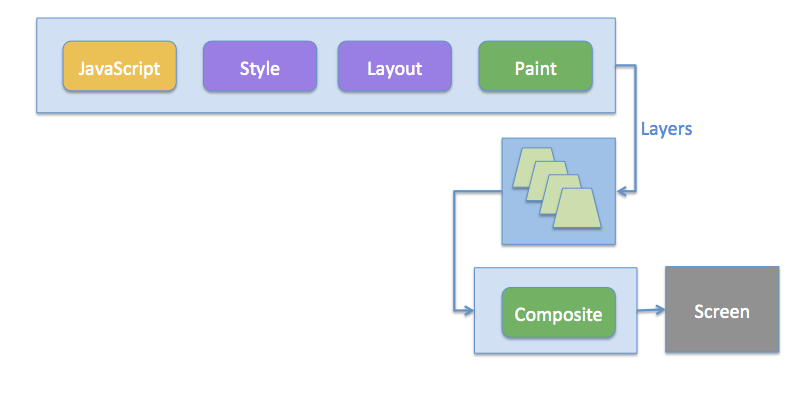

_Simplified Render Pipeline_
***

* JavaScript - Manipulate Visual Properties
* Style  - Calculating what rules apply to each element
* Layout/Reflow - Calculate element dimensions
* Paint - Draw pixels on to Layers
* Composite - Draw Layers on to the screen in the proper order

*** 
### A Bit On Layers


_Illustration by Paul Lewis_ <br> [Paul's Render Article](https://developers.google.com/web/fundamentals/performance/rendering/?hl=en)


***

### Creating layers

```css
.foo {
    will-change: left, top; /* New goodness */
}
```
* Browser is Optimized to do this on its on
* Fewer Layers - It is more expensive to repaint each
* More Layers - More Memory and more expensive to composite
* [Will Change use sparingly](https://developer.mozilla.org/en-US/docs/Web/CSS/will-change)


***
* If you change a style property that does not affect layout all render pipeline phases will execute except layout
* Lazy restyles are only calculated once - ie no reading style properties between setting them
* If you change a layout property ie sizing properties all render pipeline phases will execute
* Layouts always cause a restyle
* If you change a sytle property that is handled by the compositor neither paint or layout will execute 

***
### Demo
_(Waterfall Markers for Render Pipeline)_

***

### Properties that Affect the Pipeline

[CSSTriggers - Chrome](http://csstriggers.com/)<br>
[CSSTtriggers - Firefox Differences](https://github.com/paullewis/CSS-Triggers/pull/9)<br>
[Paul Irish List of Forced Style/Layout](https://gist.github.com/paulirish/5d52fb081b3570c81e3a)<br>


***
### A Bit on Markers

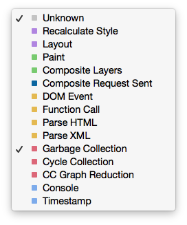

***

### Layout Thrashing
```javascript
var block = document.querySelector("#block");

function thrash() {
  for (var i=0; i < 100; i++) {
  	//getting the property causes a forced synch layout in the second iteration
    var h = block.clientWidth;
    block.style.width = (h + (1)) + "px";
  }
}
```

_"What Does This Look Like in the Tools?"_
***

### Thrash Results

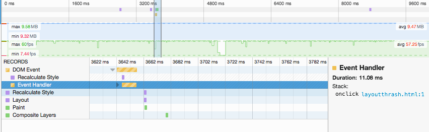
_Opening Up the Event Is A Bit Surprising_
***

### Thrash Results Deeper!

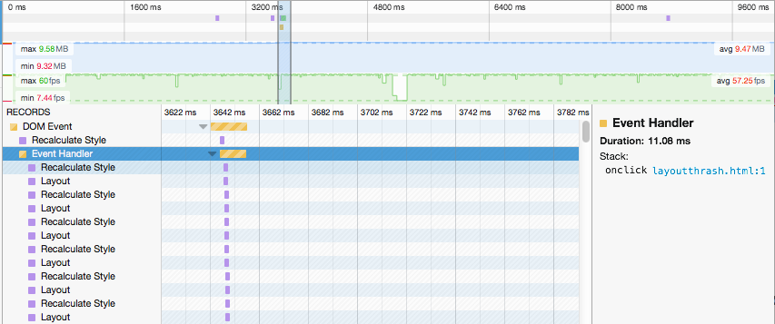
_Change The Code Slightly And We Get a Different Picture_

***
### Layout Thrashing
```javascript
var block = document.querySelector("#block");

function thrash() {
  var h = block.clientWidth;
  for (var i=0; i < 100; i++) {
    block.style.width = (h + (i) + (1)) + "px";
  }
}
```
***

### Batch Your reads and writes or use something like FastDom

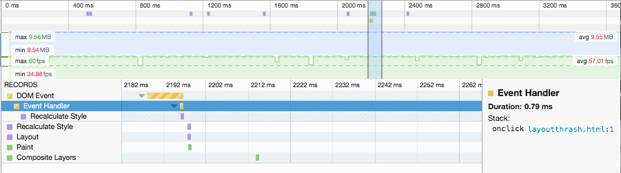
_Change The Code Slightly And We Get a Different Picture_

***

### Ideal Frame Generation

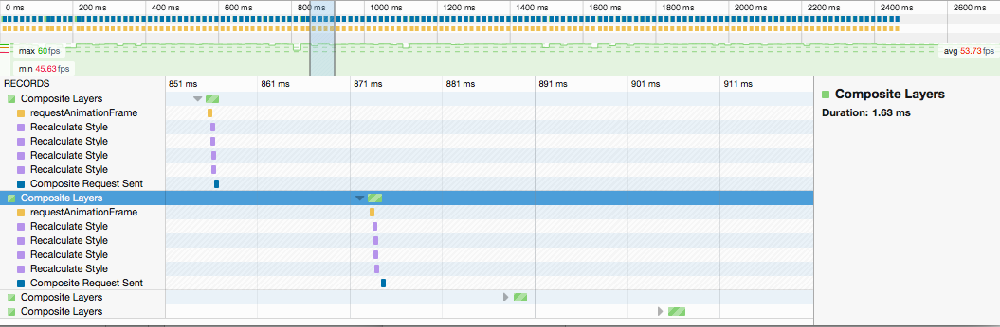
* JS calcled
* Styles and Layouts
* Paint 
* Composite with an imediate call to rAF for next frame

***

### Dropped Frames

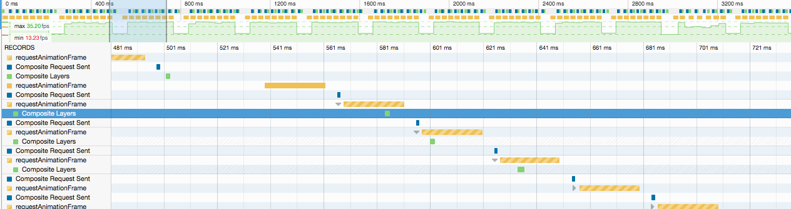
_JavaScript Taking Too Long_

***

### Render Pipeline Transform/Opacity

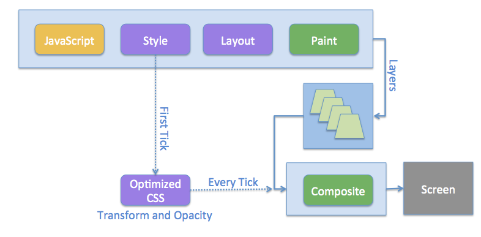

_Simplified Render Pipeline with Transform/Opacity on Compistor OMTC_
[Off Main Thread Compositing](https://wiki.mozilla.org/Platform/GFX/OffMainThreadCompositing)

***

### CSS Transform Demo

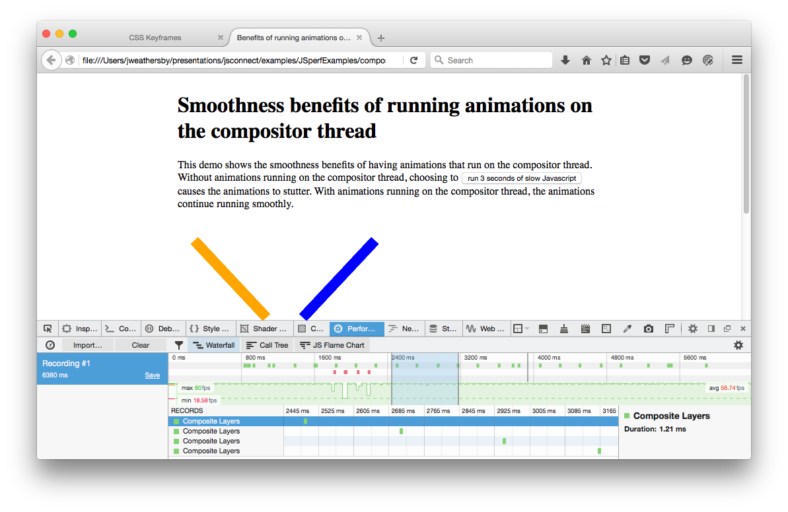


***

### CSS Animation Demo

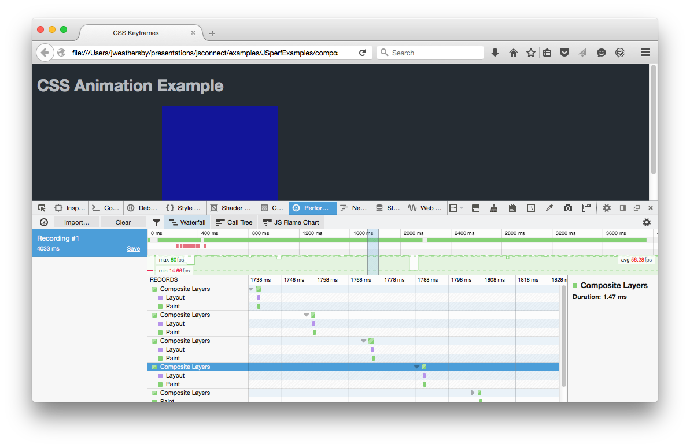


***

### APZ

_APZ on Compistor in Nightly_
_layers.async-pan-zoom.enabled_

* Scrolling happens on the compositor thread on the following platforms:
* B2G: for the viewport and scrollable subframes
* Fennec: for the viewport only. We're working on enabling it for scrollable subframes
* Desktop: for the viewport and scrollable subframes, enabled on Nightly

*** 
### Suggestions

* Use Workers when appropriate
* Use requestAnimationFrame instead of setTimeout
* Avoid long running JS on frequently called events - ie Input Handlers
* If using canvas, be sure to explore putting sprites in an offscreen canvas
* Make sure to test mobile devices
* [Mozilla Hacks Game Perf Article](https://hacks.mozilla.org/2013/05/optimizing-your-javascript-game-for-firefox-os/)
* [HTML5Rocks Perf Articles](http://www.html5rocks.com/en/features/performance) 
 


***

### DEMO

_(Performance Demos)_


---

## Memory Pressure and GC

_Memory Allocations/GC_

***
### Memory Markers


* GC markers are associated with JavaScript objects and strings
* CC-related markers are associated with the C++ structures that implement the DOM


***
### GC Incremental/Non-Incremental

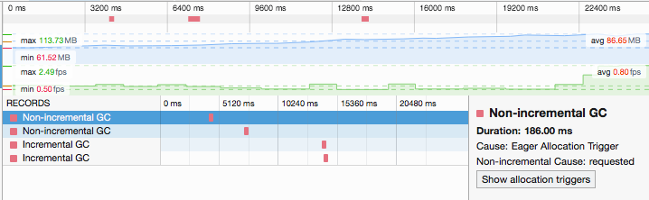
* Incremental is Ideal as it is timed to not affect performance as badly
* Non-Incremental GC's occur when you allocating objects faster than Incremental can Handle
* Large time Slices indicate large sets of variables that are being iterated for removal


***
### Memory Allocations View

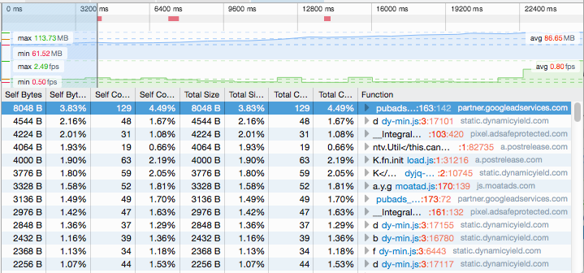
* Allocated objects for the selected range. Note that is list does not show de -allocated


***

### Example Non-Incremental Site

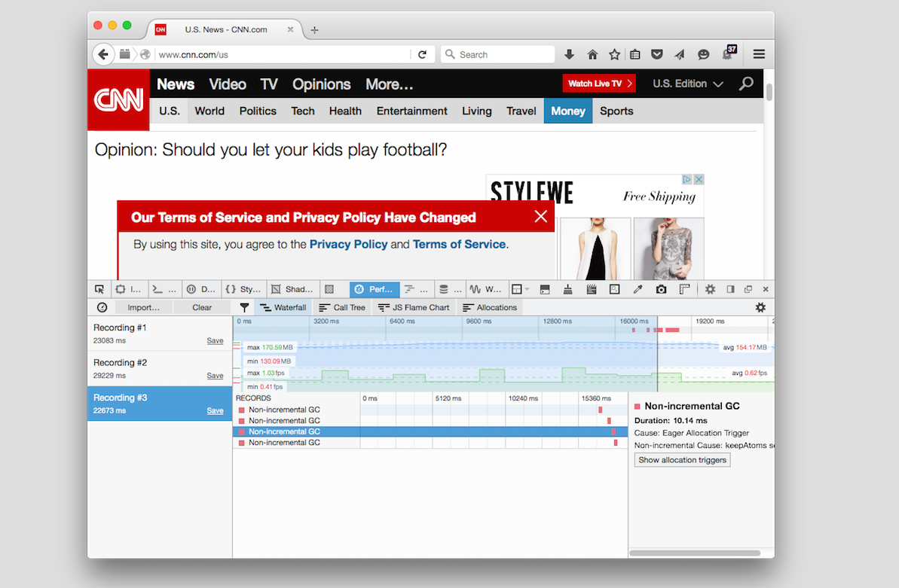
***
### Example Non-Incremental Site

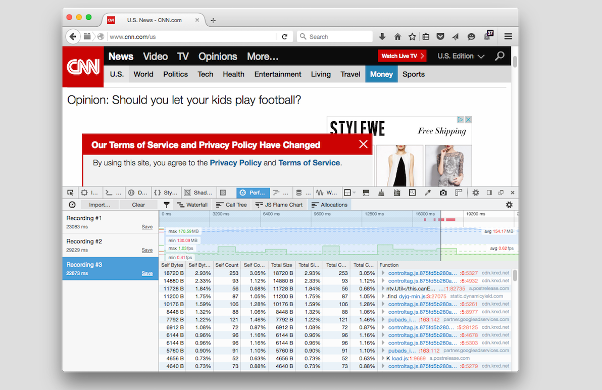
***
### Example Non-Incremental Site

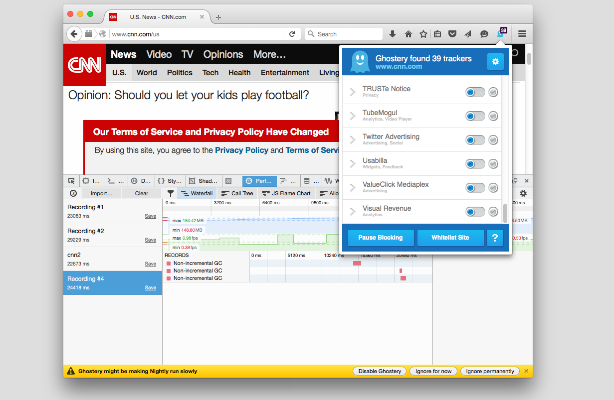

***
### Memory Growth

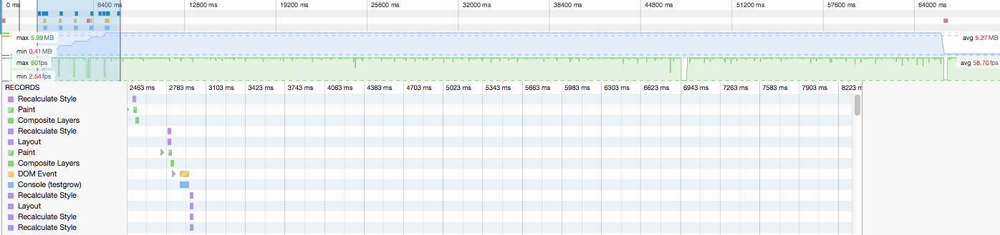

***
_Demo_

---


## For Some Extra Fun

_Emscripten Performance_
***

### Smoke

[Ed Welch's Smoke Effect](http://astronautz.com/wordpress/creating-realistic-particle-effect-with-html5-canvas/)

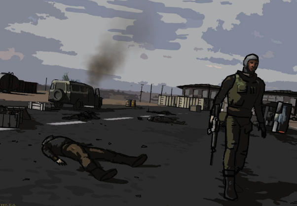

***

### DEMO

_(Emscripten Conversion)_

---
### PowerSurge

[PowerSurge Game](https://hacks.mozilla.org/2015/06/power-surge-optimize-the-javascript-in-this-html5-game-using-firefox-developer-edition/)
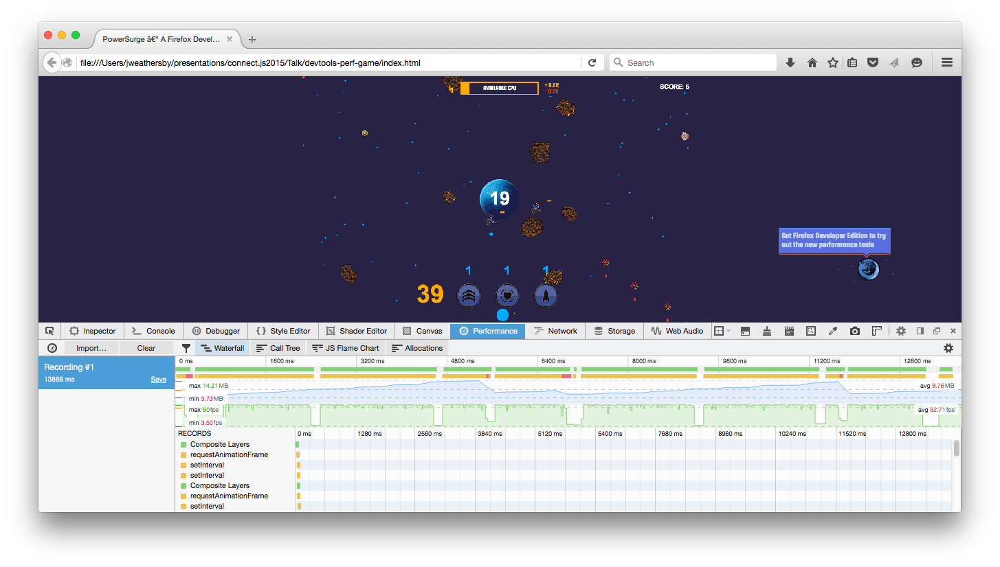
---

## Thanks!

_Jason Weathersby · [@jasonweathersby](https://twitter.com/jasonweathersby)_

[github.com/JasonWeathersby/connectjs15](ttps://github.com/JasonWeathersby/connectjs15)
